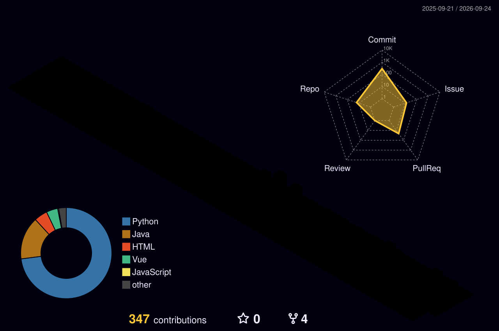

Hi! I'm a backend & AI developer who builds LLM features as **verifiable flows, not plausible answers** — Spring Boot / FastAPI services with LangGraph agents, and RL models shipped as real web services. 🧭

----
### Personal stats:

  
Proficiencies

   

  - 📚 Languages: Java, Python, TypeScript
  - ⚙️ Backend: Spring Boot, FastAPI, PostgreSQL, Redis, WebSocket
  - 🧠 AI: LangGraph / LangChain, RAG (FAISS), PyTorch (PPO), LLM output guardrails
  - 🔧 Infra & Etc.: Docker Compose, Caddy, GitHub Actions, Git

### 💪 Skills

----

